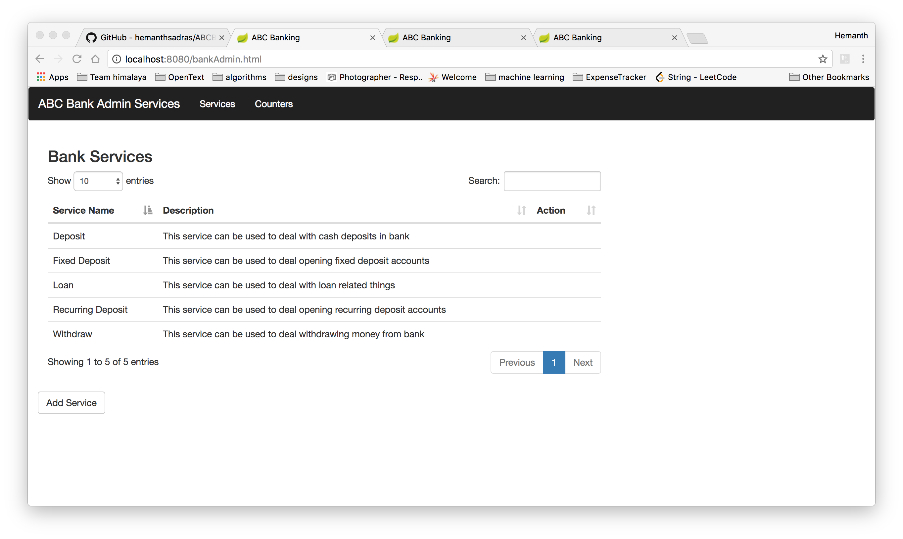
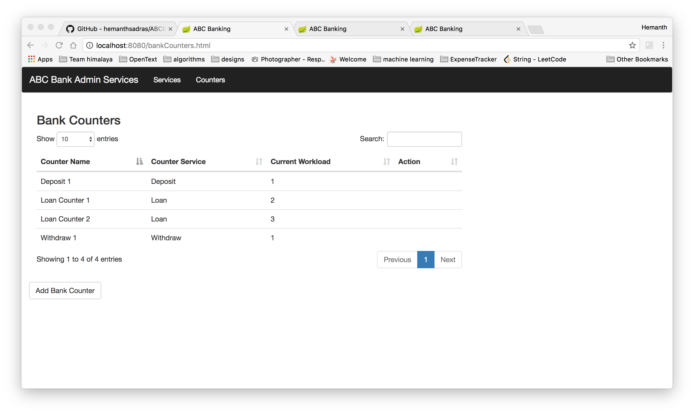
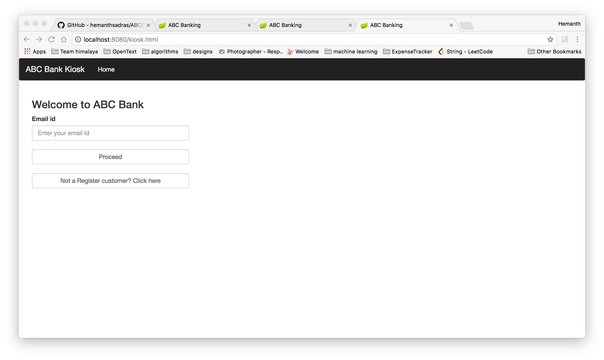
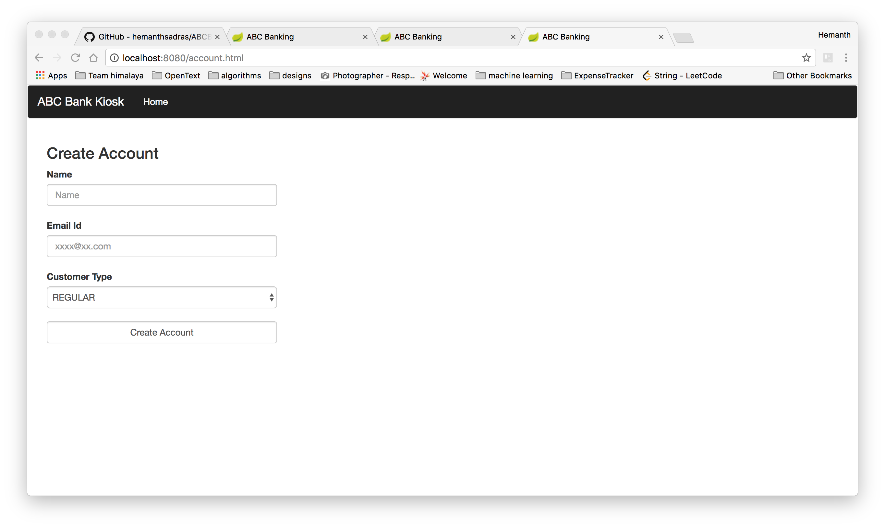
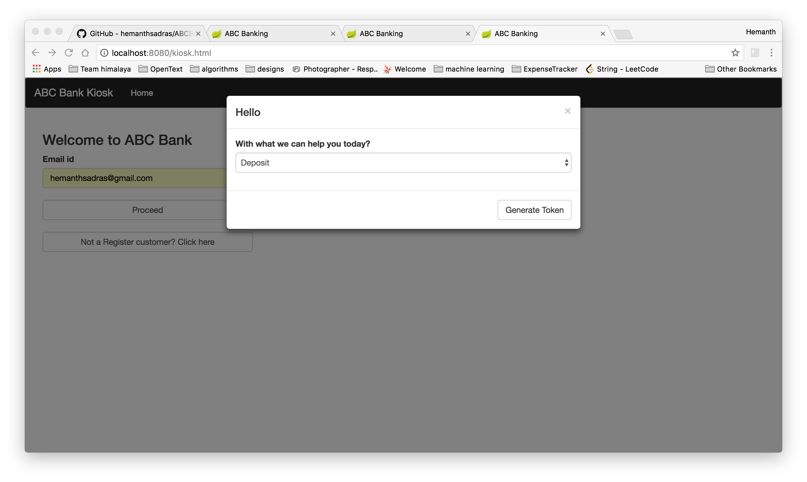
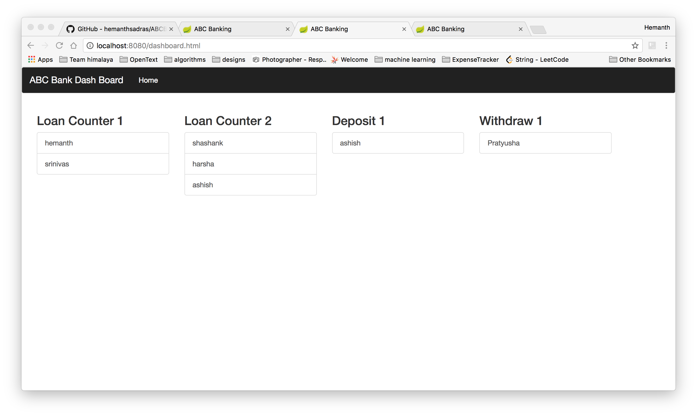

# ABCBanking Task
  
   This project contains three important set of services
   1. Bank Admin services( who can add/delete bank services and can add/delete bank counters)
   2. Counter DashBoard ( which shows list of counters and the respective customers assigned to that counter according to the priority )
   3. User services( who can register/login to avail bank services )
   
   
 
 ## Bank Admin services
 
    Bank admin can add/delete bank services like loan, deposit etc
    

    
    Bank admin can add/delete bank service counters depending up on the load on each counter,
    he can choose to add counter which servers specific bank service like Deposit
    
 
 
 
 ## User services
 
      Users will have access to the kiosk User interface as shown below
      
 
 
     if the user is not a member, he will register by clicking on Not a Register Customer, button
     and he will be redirected to creation of account page
    
 
 
     if he is already a member, he will give his unique email id and choose type of the bank service
     he wants to use and generate token
     
 
 
 
  ## Dashboard services
  
      After generating token, users will have access to dashboards where they can see in which counter
      they are assigned to, and the queue associated with that counter, PREMIUM users will be given priority 
      over the REGULAR users and dashboard will reflect the same
      
  
